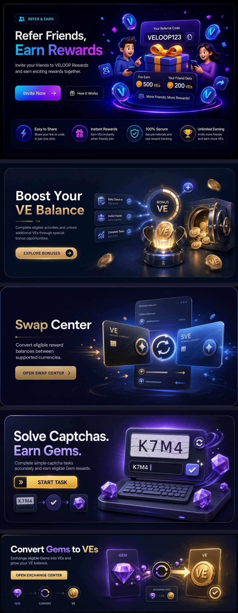

# VELOOP Rewards Banners

## Project Overview
This project contains a completely redesigned and redeveloped set of promotional and feature banners for VELOOP Rewards. The banners are built with a premium, modern, interactive, trustworthy, and reward-focused fintech design that aligns with the VELOOP Rewards design system. 

## Banner List
1. Refer & Earn Banner
2. Swap Center Banner
3. Bonus VEs Banner
4. Captcha Tasks Banner
5. Exchange Center Banner

## Features
- **Premium Fintech Design:** High-quality visuals with a #161827 background complement.
- **Fully Responsive:** Adapts to mobile (330px - 520px), tablet (380px - 540px), and desktop (410px - 450px) viewports with 100% width.
- **Interactive & Animated:** Includes hover states, floating elements, coin movements, and smooth transitions for enhanced user engagement.
- **Component-Based Architecture:** Modular design using React components for maintainability and reusability.

## Technology Stack
- **Frontend Framework:** React.js
- **Build Tool:** Vite
- **Styling:** CSS Modules (.module.css)
- **Routing:** React Router v6
- **Icons:** Lucide React & React Icons

## Installation Instructions

1. Clone the repository:
   ```bash
   git clone <your-repository-url>
   cd veloop-rewards
   ```

2. Install dependencies:
   ```bash
   npm install
   ```

## Development Commands

- Start the development server:
  ```bash
  npm run dev
  ```
- Build for production:
  ```bash
  npm run build
  ```
- Preview the production build:
  ```bash
  npm run preview
  ```

## Folder Structure
```
src/
├── components/
│   ├── BannerWrapper/
│   ├── BonusVEsBanner/
│   ├── CaptchaTasksBanner/
│   ├── ExchangeCenterBanner/
│   ├── ReferEarnBanner/
│   └── SwapCenterBanner/
├── pages/
│   ├── BonusVEsPage.jsx
│   ├── CaptchaTasksPage.jsx
│   ├── ExchangeCenterPage.jsx
│   ├── Home.jsx
│   ├── ReferEarnPage.jsx
│   └── SwapCenterPage.jsx
├── assets/
├── index.css
├── App.css
├── App.jsx
└── main.jsx
```

## Responsive Design
- **Desktop:** 410px - 450px height
- **Tablet:** 380px - 540px height
- **Mobile:** 330px - 520px height
- Width is always 100% of the container.

## Animation Details
- **Hover Interactions:** Banners elevate and glow on hover. Buttons have distinct hover states.
- **Subtle Movements:** Floating coins, subtle progress bars, and glowing effects that enhance the premium feel without impacting performance.
- **Transitions:** Smooth, optimized CSS transitions for scaling and colors.

## Screenshots


## Live Demo
- [https://veloop-rewards-banners-hazel.vercel.app/]

## GitHub Repository
- [https://github.com/nandinisihare2332/veloop-rewards-banners.git]

## Author
Nandini
